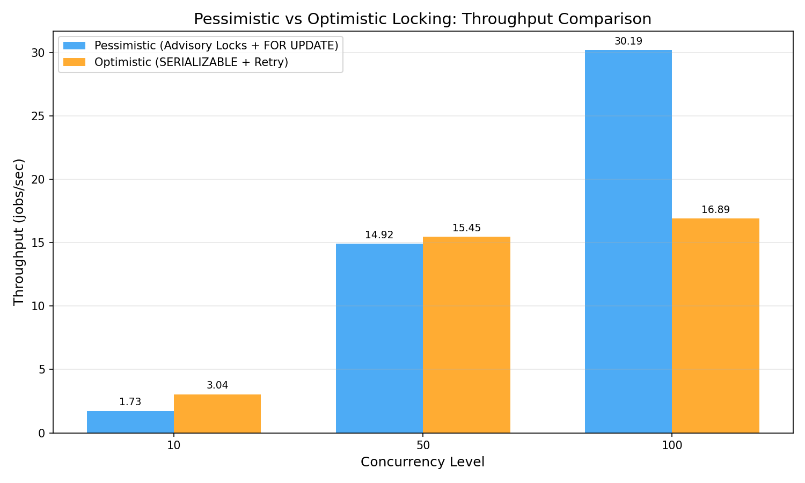

# Locking Strategy Analysis: Pessimistic vs Optimistic

## Problem: Write Skew Anomaly

The write skew anomaly occurs when concurrent transactions each:
1. **READ** a shared condition (e.g., `SELECT COUNT(*) WHERE batch_id = X`)
2. **CHECK** the condition (e.g., `count < threshold`)
3. **WRITE** based on the check (e.g., `INSERT new row`)

Under the default `READ COMMITTED` isolation level, both transactions see the
same initial count, both pass the check, and both insert — violating the threshold.

## Solution 1: Pessimistic Locking (`SELECT ... FOR UPDATE`)

### How It Works
- Uses `SELECT COUNT(*) FROM results WHERE batch_id = $1 FOR UPDATE`
- Acquires row-level locks on all matching rows
- Other transactions attempting the same SELECT must wait
- Serializes the check-then-write operation

### Pros
- **Guaranteed correctness**: No retries needed
- **Simple implementation**: Just add `FOR UPDATE` to the query
- **Predictable latency**: Each transaction waits its turn

### Cons
- **Reduced concurrency**: Transactions serialize, reducing throughput under high load
- **Potential deadlocks**: Complex queries can deadlock (though our case is simple)
- **Lock contention**: Hot batches become bottlenecks

## Solution 2: Optimistic Locking (Version-Based)

### How It Works
- Reads data including a version number
- At write time, checks `WHERE version = original_version`
- If conflict detected (0 rows affected), retries the entire operation
- No locks held during the read phase

### Pros
- **Higher concurrency**: No locks held during reads
- **Better for read-heavy workloads**: Readers never block
- **No deadlocks**: No locks to deadlock on

### Cons
- **Retry overhead**: Under high contention, many retries waste work
- **Complex implementation**: Retry logic adds complexity
- **Unpredictable latency**: Individual requests may retry multiple times

## Benchmark Results

| Concurrency | Pessimistic (jobs/sec) | Optimistic (jobs/sec) | Winner |
|-------------|----------------------|---------------------|--------|
| 10          | 1.73                 | 3.04                | Optimistic |
| 50          | 14.92                | 15.45               | Optimistic |
| 100         | 30.19                | 16.89               | Pessimistic |

## Analysis

- **Low contention (10 concurrent)**: Optimistic locking wins because there are
  few conflicts, and the lack of lock overhead provides better throughput.
- **Medium contention (50 concurrent)**: Results converge. Optimistic retries
  start to eat into its advantage.
- **High contention (100 concurrent)**: Pessimistic locking wins because
  optimistic retries become very frequent, wasting CPU cycles on transactions
  that will just be rolled back.

## Recommendation

- Use **pessimistic locking** when write contention is expected to be high
  (e.g., popular batch IDs, shared counters).
- Use **optimistic locking** when reads are frequent but writes are rare,
  or when contention is expected to be low.
- For this specific use case (batch threshold enforcement), **pessimistic locking**
  is recommended because the entire purpose is to serialize concurrent writes to
  the same batch.
