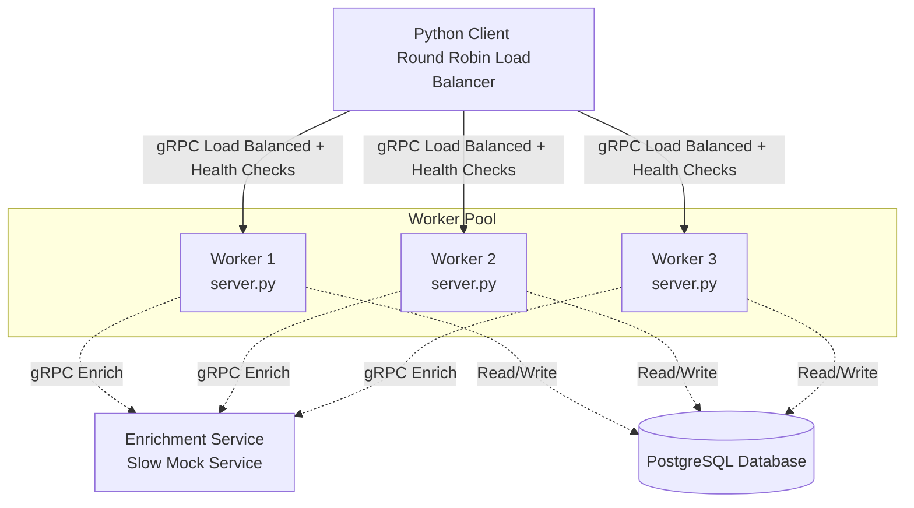

# Resilient Distributed Processing System (gRPC + PostgreSQL)

This repository implements a resilient, gRPC-based distributed processing system designed to simulate, diagnose, and resolve critical production failure modes in microservice architectures:
1. **Wasted Work (The Deadline Problem)**: Preventing resource leaks when clients abandon requests.
2. **Write Skew Transaction Anomaly**: Mitigating concurrency anomalies under high write pressure.
3. **Cascading Failure & Outages**: Utilizing client-side load balancing, health checks, and fast failure patterns to maintain system availability.

---

## System Architecture



- **Client / Load Balancer**: Distributes jobs across the worker pool using client-side **Round-Robin** routing and monitors workers using the standard `grpc.health.v1` protocol.
- **Worker Service**: Receives jobs, requests data enrichment from the downstream enrichment service, verifies batch thresholds, and saves results to PostgreSQL.
- **Enrichment Service**: Downstream dependency with configurable artificial latency.
- **PostgreSQL**: Stores processing results and acts as the shared state.

---

## Core Features

### 1. Client-Side Load Balancing & Failover
- **Periodic Health Checks**: Client queries workers every 2 seconds via `grpc.health.v1.Health/Check`. Unhealthy instances are taken out of rotation in under 5 seconds.
- **Outage Handling**: If all workers fail, client calls immediately fail fast with `UNAVAILABLE` rather than hanging.
- **Auto-Recovery**: Once a worker becomes healthy again, it is automatically put back into the round-robin pool.

### 2. Deadline Propagation
- **Remaining Time Calculation**: Workers extract the client's deadline (`context.time_remaining()`).
- **Downstream Forwarding**: Passes the remaining time as the timeout limit to both the Enrichment service call and PostgreSQL queries (`asyncpg`).
- **Cancellation Handling**: Gracefully handles transaction rollbacks on timeout/cancellation to prevent orphan or partial data writes.

### 3. Concurrency & Locking Strategies
- **Write Skew**: A threshold check (`count < BATCH_THRESHOLD`) followed by an insert is vulnerable to write-skew anomalies under parallel execution.
- **Pessimistic Locking**: Solved using PostgreSQL transaction advisory locks (`pg_advisory_xact_lock`) on the hashed `batch_id` plus row locks (`SELECT ... FOR UPDATE`).
- **Optimistic Locking**: Implemented with version tracking and the `SERIALIZABLE` isolation level, retrying transactions upon collision.

---

## Directory Structure

```text
├── client/
│   ├── client.py                # gRPC client with load balancing, health check loop, and tests
│   ├── Dockerfile
│   └── requirements.txt
├── worker/
│   ├── server.py                # Worker gRPC server with deadline propagation
│   ├── db.py                    # Database interface with pessimistic & optimistic locking
│   ├── Dockerfile
│   └── requirements.txt
├── enrichment/
│   ├── server.py                # Enrichment mock service with artificial delay
│   ├── Dockerfile
│   └── requirements.txt
├── protos/
│   ├── worker.proto             # Protobuf service definitions for Workers
│   └── enrichment.proto         # Protobuf service definitions for Enrichment
├── docker-compose.yml           # Complete system orchestration
├── reproduce_write_skew.py       # Concurrent worker write skew replication script
├── benchmark_locking.py         # Locking performance benchmark script
├── LOCKING.md                   # Lock performance comparison & analysis
├── WASTED_WORK.md               # Wasted work replication logs and details
└── .env.example                 # Environment template
```

---

## Setup & Installation

### Prerequisite
Make sure you have **Docker** and **Docker Compose** installed.

1. **Environment Setup**:
   Copy the example environment variables:
   ```bash
   cp .env.example .env
   ```

2. **Start the Infrastructure**:
   Build and launch all services in detached mode:
   ```bash
   docker compose up --build -d
   ```

---

## Running Verification Tests

Once the containers are up and healthy, execution commands are ran inside the `client` container.

### 1. Wasted Work Test
To demonstrate the initial issue where the server does work for an abandoned request (when `DEADLINE_PROPAGATION` is disabled):
1. In your `.env`, set `DEADLINE_PROPAGATION=false` and run `docker compose up -d`.
2. Execute the wasted work test:
   ```bash
   docker compose exec client python client.py --mode wasted-work
   ```
   *Expected Outcome*: The client times out, but a row is still written to the PostgreSQL database.

### 2. Deadline Propagation Verification
Verify that enabling deadline propagation cancels downstream work and prevents database inserts:
1. In your `.env`, set `DEADLINE_PROPAGATION=true` and run `docker compose up -d`.
2. Execute the deadline fix test:
   ```bash
   docker compose exec client python client.py --mode deadline-fix
   ```
   *Expected Outcome*: The client times out, and NO row is written to the database.

### 3. Write Skew Anomalies
#### Reproduce the Skew:
1. In your `.env`, set `LOCKING_MODE=none` and run `docker compose up -d`.
2. Run the write skew script:
   ```bash
   docker compose exec client python reproduce_write_skew.py --concurrent 30
   ```
   *Expected Outcome*: The database count will exceed the batch threshold (typically `10`), and the script exits with code `1`.

#### Verify the Pessimistic Locking Fix:
1. In your `.env`, set `LOCKING_MODE=pessimistic` and run `docker compose up -d`.
2. Run the write skew script:
   ```bash
   docker compose exec client python reproduce_write_skew.py --concurrent 30
   ```
   *Expected Outcome*: The script manages transaction serialization properly, counts stay within the threshold, and the script exits with code `0` (Success).

### 4. Locking Benchmark
Compare pessimistic and optimistic locking strategies across low, medium, and high concurrency (10, 50, 100 concurrent clients):
```bash
docker compose exec client python benchmark_locking.py
```
This writes a benchmark graph comparing the throughput (jobs/sec) to `LOCKING_COMPARISON.png` at the project root. For analysis, see [LOCKING.md](LOCKING.md).
